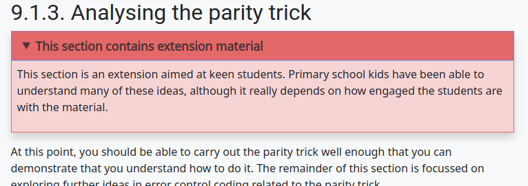

Writing Guide
##############################################################################

The CS Field Guide is developed in English and then translated into other languages.
You can find more information about this on the :ref:`translations` page.

The majority of our text content is written in Markdown, and we also developed
a program called `Verto`_ to allow you to include HTML elements like images and
videos with simple text tags.

For example, the following text:

.. code-block:: none

  {panel type="teacher-note"}

  # This section contains extension material

  This section is an extension aimed at keen students.
  Primary school kids have been able to understand many of these ideas, although it really depends on how engaged the students are with the material.

  {panel end}

will display as the following on the website:



.. note::

  If you already know Markdown syntax, please remember the following project
  preferences (for consistency and readability):

  - Use asterisks (``*``) for emphasis, instead of underscores.
  - Use hyphens (``-``) for unordered lists.
  - No HTML within text files, we use Verto text tags to add iframes,
    images, videos, etc.

Below is a basic guide to syntax for Markdown and Verto text tags.
When viewing Verto documentation for a tag, the top of the page will detail how to use the tag in a basic example.
Some text tags also have required and/or optional tag parameters for further configuration.

.. contents:: Text Syntax
  :local:

------------------------------------------------------------------------------

Blockquotes
==============================================================================

.. code-block:: none

  > Blockquotes are very handy to emulate reply or output text.
  > This line is part of the same quote.

  Quote break.

  > Oh, you can *put* **Markdown** into a blockquote.

.. raw:: html
  :file: ../_static/html_snippets/markdown_example_blockquote.html

------------------------------------------------------------------------------

Boxed Text (Verto feature)
==============================================================================

`Click here to read the documentation on how to box text`_.

------------------------------------------------------------------------------

Code
==============================================================================

You are able to include code snippets, either in a line of text or as a new block.

To include inline code, add a backtick to either side of the code.
For example: \`print("Hi")\` will display as ``print("Hi")``.
You cannot set the language syntax highlighting for inline code.

To create a code block, use a line of three backticks before and after the code.
You also can add syntax highlighting by specifying the language after the first set of backticks (`list of language codes`_).

.. code-block:: none

  ```python3
  def find_high_score(scores):
      if len(scores) == 0:
          print("No high score, table is empty")
          return -1
      else:
          highest_so_far = scores[0]
          for score in scores[1:]:
              if score > highest_so_far:
                  highest_so_far = score
          return highest_so_far
  ```

.. code-block:: python3

  def find_high_score(scores):
      if len(scores) == 0:
          print("No high score, table is empty")
          return -1
      else:
          highest_so_far = scores[0]
          for score in scores[1:]:
              if score > highest_so_far:
                  highest_so_far = score
          return highest_so_far

------------------------------------------------------------------------------

Comment (Verto feature)
==============================================================================

`Click here to read the documentation on how to add a comment`_.

------------------------------------------------------------------------------

Conditional (Verto feature)
==============================================================================

`Click here to read the documentation on how to define a conditional`_.

------------------------------------------------------------------------------

Embedded iframe (Verto feature)
==============================================================================

`Click here to read the documentation on how to embed with an iframe`_.

------------------------------------------------------------------------------

Emphasis
==============================================================================

.. code-block:: none

  Emphasis, aka italics, with *asterisks*.

  Strong emphasis, aka bold, with **asterisks**.

Emphasis, aka italics, with *asterisks*.

Strong emphasis, aka bold, with **asterisks**.

.. note::

  We do not use underscores for emphasis to maintain consistency and readability.

------------------------------------------------------------------------------

Glossary Link (Verto feature)
==============================================================================

`Click here to read the documentation on how to define a glossary link`_.

------------------------------------------------------------------------------

Heading (Verto feature)
==============================================================================

`Click here to read the documentation on how to create a heading`_.

------------------------------------------------------------------------------

Image (Verto feature)
==============================================================================

`Click here to read the documentation on how to include an image`_.

------------------------------------------------------------------------------

.. _writing-guide-interactive:

Interactive (Verto feature)
==============================================================================

`Click here to read the documentation on how to include an interactive`_.

------------------------------------------------------------------------------

Line Breaks
==============================================================================

Here are some things to try out:

.. code-block:: none

  Here's a line for us to start with.

  This line is separated from the one above by two newlines, so it will be a **separate paragraph**.

  This line is also a separate paragraph.
  However, *this* line is only separated by a single newline in the markdown file.
  These are new sentences that will appear **on the same line** as each previous one.

  When writing markdown, new sentences should be started on a new line for clarity.
  An exception is for really small sentences like this:
  Is it one? two? three?

.. raw:: html
  :file: ../_static/html_snippets/markdown_example_line_break.html

------------------------------------------------------------------------------

Links
==============================================================================

There are several links that may be used:

The general syntax for links is ``[link text](link url)`` where ``link text`` is the text to be displayed in the document, and ``link url`` is the destination of the link.

**Escaping closing brackets within link URLs:** A closing bracket can be escaped by prefixing it with a backslash ``\)``.

Internal links
------------------------------------------------------------------------------

These are links to pages within the CS Field Guide website.
These links will not work when viewed in a Markdown renderer, however these will function properly when converted to HTML and viewed on the website.

Link to Page Within Website (relative link - Verto feature)
------------------------------------------------------------------------------

You can refer to a chapter page with the following syntax:

.. code-block:: none

  [link text]('chapters:chapter' '<chapter-key>')

As an example, the following would link to the complexity and tractability chapter:

.. code-block:: none

  [complexity and tractability]('chapters:chapter' 'complexity-and-tractability')

You can link to a chapter section with similar syntax:

.. code-block:: none

  [link text]('chapters:chapter-section' '<chapter-key>' '<chapter-section-key>')

Links to an interactive follow the same syntax as a chapter link, except 'chapter' is replaced with 'interactive'.

.. code-block:: none

  [link text]('interactives:interactive' '<interactive-key>')

To reference an interactive with URL parameters the syntax is:

.. code-block:: none

  [link text]('interactives:interactive' '<interactive-key>'?<url-parameters>)


Examples:

.. code-block:: none

  Check out the chapter on [algorithms]('chapters:chapter' 'algorithms').
  Check out [interface usability]('chapters:chapter-section' 'human-computer-interaction' 'interface-usability').
  [Regular Expression Searcher]('interactives:interactive' 'regular-expression-search')

Keys are defined in configuration files.

Some pages will not require keys, such as appendix pages or the homepage.

.. code-block:: none

  [link text]('appendices:<url-pattern-name>')

Some examples:

.. code-block:: none

  Check out the [about page]('appendices:about').
  [Homepage]('general:index')

`Click here to read the documentation on how to create a relative link`_.


Link to a Page Outside of Website (external link)
------------------------------------------------------------------------------

These are links to websites that are not a part of the CS Field Guide project.
The URL should include the ``https://`` or ``http://`` as required.

.. code-block:: none

  Check out [Google's website](https://www.google.com).

Create a Link on an Image (Verto feature)
------------------------------------------------------------------------------

Images should now be linked using the ``caption-link`` and ``source`` tag parameters for including an image.
See the Verto documentation on the `image processor`_ for more information and examples.

Create a Link on a Button (Verto feature)
------------------------------------------------------------------------------

`Click here to read the documentation on how to add a button link`_.

------------------------------------------------------------------------------

Lists
==============================================================================

Lists can be created by starting each line with a ``-`` for unordered lists or ``1.`` for ordered lists.
The list needs to be followed by a blank line, however it doesn't require a blank line before unless the preceding text is a heading (a blank line is then required).
If you are having issues with a list not rendering correctly, try adding a blank line before the list if there is none, otherwise `submit a bug report`_ if you are still having rendering issues.

.. code-block:: none

  Unordered list:
  - Item 1
  - Item 2
  - Item 3

  Ordered list:
  1. Item 1
  2. Item 2
  3. Item 3

Unordered list:

- Item 1
- Item 2
- Item 3

Ordered list:

1. Item 1
2. Item 2
3. Item 3

Nested lists can be created by indenting each level by 4 spaces.

.. code-block:: none

  1. Item 1
    1. A corollary to the above item, indented by 4 spaces.
    2. Yet another point to consider.
  2. Item 2
    * A corollary that does not need to be ordered.
      * This is indented eight spaces, because it's four for each level.
      * You might want to consider making a new list by now.
  3. Item 3

1. Item 1

  1. A corollary to the above item, indented by 4 spaces.
  2. Yet another point to consider.

2. Item 2

  * A corollary that does not need to be ordered.

    * This is indented eight spaces, because it's four for each level.
    * You might want to consider making a new list by now.

3. Item 3

------------------------------------------------------------------------------

Math
==============================================================================

To include math (either inline or as a block) use the following syntax while using LaTeX syntax.

.. code-block:: none

  This is inline math: \( 2 + 2 = 4 \)

  This is block math:

  \[ \begin{bmatrix} s & 0 \\ 0 & s \\ \end{bmatrix} \]

Math equations are rendered in MathJax using the LaTeX syntax.

.. image:: ../_static/img/math_markdown_example.png
  :alt: An image showing the above Markdown syntax rendered as HTML

------------------------------------------------------------------------------

Panel (Verto feature)
==============================================================================

`Click here to read the documentation on how to create a panel`_.

------------------------------------------------------------------------------

Scratch (Verto feature)
==============================================================================

`Click here to read the documentation on how to include an image of Scratch block`_.

------------------------------------------------------------------------------

Table of Contents (Verto feature)
==============================================================================

`Click here to read the documentation on how to include a table of contents`_.

------------------------------------------------------------------------------

Tables
==============================================================================

Tables can be created using the following syntax:

.. code-block:: none

  Colons can be used to align columns.

  | Tables        | Are           | Cool  |
  | ------------- |:-------------:| -----:|
  | col 3 is      | right-aligned | $1600 |
  | col 2 is      | centered      |   $12 |
  | zebra stripes | are neat      |    $1 |

.. raw:: html
  :file: ../_static/html_snippets/markdown_example_table.html

The outer pipes (|) are optional, and you don't need to make the raw Markdown line up prettily, but there must be at least 3 dashes separating each header cell.
You can also use inline Markdown.

.. code-block:: none

  Markdown | Less | Pretty
  --- | --- | ---
  *Still* | `renders` | **nicely**
  1 | 2 | 3

.. raw:: html
  :file: ../_static/html_snippets/markdown_example_table_2.html

------------------------------------------------------------------------------

Video (Verto feature)
==============================================================================

`Click here to read the documentation on how to include a video`_.

------------------------------------------------------------------------------

Writing structure
==============================================================================

Chapters always contain the following:

  - An introduction page, which introduces the reader to the chapter.
  - Several chapter sections, which each cover a key sub topic of the main chapter.
  - A ``The whole story!`` page, which should mention some other related concepts not covered by the chapter.
  - A ``Further reading`` page, which contains links and/or book references where students can investigate the topic further.

------------------------------------------------------------------------------

.. _Verto: http://verto.readthedocs.io/en/latest/
.. _submit a bug report: https://github.com/uccser/cs-field-guide/issues/new
.. _Click here to read the documentation on how to box text: http://verto.readthedocs.io/en/latest/processors/boxed-text.html
.. _list of language codes: https://haisum.github.io/2014/11/07/jekyll-pygments-supported-highlighters/
.. _Click here to read the documentation on how to add a comment: http://verto.readthedocs.io/en/latest/processors/comment.html
.. _Click here to read the documentation on how to define a conditional: http://verto.readthedocs.io/en/latest/processors/conditional.html
.. _Click here to read the documentation on how to embed with an iframe: http://verto.readthedocs.io/en/latest/processors/iframe.html
.. _Click here to read the documentation on how to define a glossary link: http://verto.readthedocs.io/en/latest/processors/glossary-link.html
.. _Click here to read the documentation on how to create a heading: http://verto.readthedocs.io/en/latest/processors/heading.html
.. _Click here to read the documentation on how to include an image: http://verto.readthedocs.io/en/latest/processors/image.html
.. _Click here to read the documentation on how to include an interactive: http://verto.readthedocs.io/en/latest/processors/interactive.html
.. _Click here to read the documentation on how to create a relative link: http://verto.readthedocs.io/en/latest/processors/relative-link.html
.. _Click here to read the documentation on how to add a button link: http://verto.readthedocs.io/en/latest/processors/button-link.html
.. _Click here to read the documentation on how to create a panel: http://verto.readthedocs.io/en/latest/processors/panel.html
.. _Click here to read the documentation on how to include an image of Scratch block: http://verto.readthedocs.io/en/latest/processors/scratch.html
.. _Click here to read the documentation on how to include a table of contents: http://verto.readthedocs.io/en/latest/processors/table-of-contents.html
.. _Click here to read the documentation on how to include a video: http://verto.readthedocs.io/en/latest/processors/video.html
.. _image processor: https://verto.readthedocs.io/en/latest/processors/image.html
