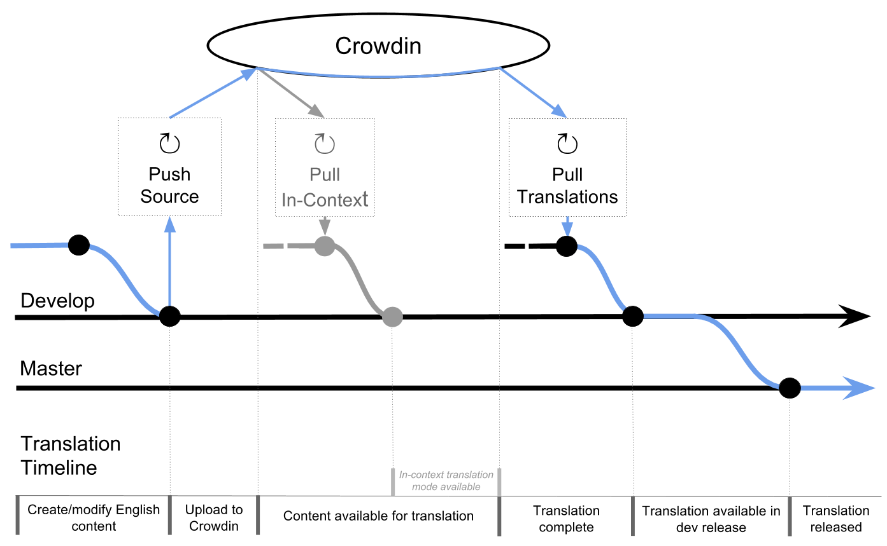

Translation Infrastructure
##############################################################################

.. note::

  The in-context translation has been removed temporarily as translation infrastructure is being updated.
  We aim to `re-add this feature in a future update <https://github.com/uccser/arnold/issues/4>`__.

Crowdin
==============================================================================
We use a localisation management platform called `Crowdin <https://crowdin.com/project/cs-field-guide>`_ for translation of CS Field Guide.
The project is public, meaning that anyone can create an account and contribute translations.

Translatable Files
==============================================================================
There are 4 types of files that contain translatable content:

- Content Markdown files
- HTML templates
- JavaScript code
- ``django.po`` file containing translatable system strings

Content Markdown source files must always reside under an ``en`` directory tree.
Translated files are downloaded into a directory named with the language's locale code, and with the same structure as the source tree.

.. note::

  The locale code differs from the language code in format - where a language code is of form ``ab-cd``, the locale code will be ``ab_CD``.
  Directories must be named using the locale code recognised by django for that language.

  For more information, see

  - https://docs.djangoproject.com/en/1.11/topics/i18n/
  - https://github.com/django/django/tree/master/django/conf/locale
  - https://github.com/django/django/blob/master/django/utils/translation/trans_real.py#L59

The configuration specifying which files should be uploaded for translation is stored in the file ``.arnold.yaml`` in the repository root.
Details about the structure of this file are available within the `Arnold repository <https://github.com/uccser/arnold>`__.

Review Process
==============================================================================
For a translation of any given string to make it to production release, it must pass the following stages of review:

1. (Crowdin) Translation Proofread - Review by a second translator with 'proofreader' status in the target language.
2. (GitHub) Technical Review - Review by a member of the CS Field Guide technical team to catch technical errors (i.e. with Verto tags, links, Markdown syntax etc). 
   Automated testing on travis will also occur at this stage.

Translation Pipeline
==============================================================================

The translation pipeline is implemented by the `Arnold repository <https://github.com/uccser/arnold>`__.
The following diagram gives a broad overview of the translation pipeline.
The blue arrows indicate the path from a source file change through to the release of the translation for that change.

